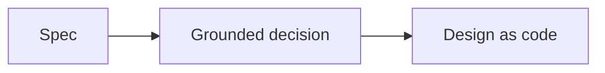

# Mermaid preview smoke test

Open **Markdown: Open Preview to the Side** in VS Code 1.121 or later (or in the facilitator's pretested
older-version fallback). You should see three connected boxes, not a literal Mermaid code block.

